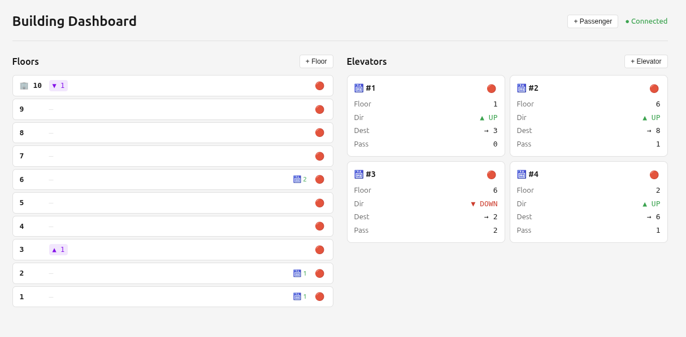

# dotnetElevators

Office building elevator simulator using `Channel<T>`-based background services with an ASP.NET Web API and real-time SignalR broadcasts.

## Stack

- .NET 10
- ASP.NET Core (`Microsoft.NET.Sdk.Web`)
- SignalR for real-time client updates
- `System.Threading.Channels` for per-elevator async queues
- React

## Architecture

```
PassengerTimer (timed background loop)
       |
       v
PassengerService.AddNewPassenger()
       |     \
       |      +---> BuildingBroadcastService (SignalR: ElevatorUpdated / FloorUpdated / PassengerUpdated)
       v
BuildingService.CallElevator() -> dispatches best idle elevator
       |
       v
QueueManager (4 x Channel<QueueItem>, one per elevator)
       |
       v
ElevatorManagementService (4 readers, processes arrivals)
       |
       v
BuildingService.ElevatorArrivesAtFloor()
       |
       v
Elevator.ArriveAtFloor() -> AddPassengers / SetDestination / DirectionChangedCheck (VIP)
```

## VIP Passengers

VIP passengers cause the elevator to skip all intermediate floors until the VIP's destination is reached. When VIPs exit:
- `DirectionChangedCheck` evaluates remaining passengers
- If all remaining destinations are behind the current floor, elevator reverses direction
- After reversal, boards any queued passengers going the new direction at the current floor

VIP probability controlled by `VIP_PROBABILITY` in `Building.cs` (default 0.01).

## SignalR Hub

| Hub | Route |
|---|---|
| `BuildingHub` | `/hubs/building` |

### Events

| Event | Payload | Fires when |
|---|---|---|
| `ElevatorUpdated` | `ElevatorDTO` | Elevator dispatched, arrives at floor, changes direction, or VIP enters |
| `FloorUpdated` | `FloorDTO` | Passenger queued or departs from a floor |
| `PassengerUpdated` | `PassengerDTO` | Passenger created (spawned via timer or API) |

### Test client

```bash
dotnet run --project server/test
```

Connects to `http://localhost:5000/hubs/building` and prints events. Press Enter to exit.

## Web App

React dashboard with real-time SignalR updates showing floors, elevators, and controls for managing the building.



### Features

- Real-time floor status with queued passenger counts (▲ UP / ▼ DOWN) and VIP badges
- Elevator cards showing current floor, direction, destination, passenger count, and VIP status
- Toggle floors/elevators active/inactive
- Add new floors and elevators
- Spawn passengers with optional VIP status

```bash
cd client
npm install
npm run dev
```

Opens `http://localhost:5173` by default. Requires the server to be running on `http://localhost:5000`.

## REST API Endpoints

| Method | Route | Description |
|---|---|---|
| `GET` | `/api/floors` | All floors with queued passenger counts by direction |
| `GET` | `/api/floors/{floorNumber}` | Single floor status |
| `GET` | `/api/elevators` | All elevators (current floor, direction, occupancy, destination) |
| `GET` | `/api/elevators/{id}` | Single elevator state |
| `GET` | `/api/passengers` | All passengers (waiting on floors or riding elevators) |
| `GET` | `/api/passengers/{id}` | Single passenger status |
| `POST` | `/api/passengers` | Spawn one or more passengers |

### POST /api/passengers

```json
{
  "floor": 3,
  "destination": 8,
  "passengerCount": 2,
  "vip": true,
  "randomizeVip": false
}
```

Fields are optional. `0` or omitted values pick random floor/destination. `vip` marks all spawned passengers as VIP. `randomizeVip` applies `VIP_PROBABILITY` per passenger.

## Running

```bash
# Start the simulation + API
dotnet run --project server/src

# In another terminal, watch events
dotnet run --project server/tests
```

Opens `http://localhost:5000` by default. Simulation runs immediately; API and SignalR hub are available on startup.

## Config

All in `Building.cs`:

| Constant | Default |
|---|---|
| `MAX_OCCUPANCY` | 12 |
| `MIN_FLOOR` | 1 |
| `MAX_FLOOR` | 10 |
| `ELEVATOR_COUNT` | 4 |
| `ELEVATOR_TRAVEL_SPEED_SEC` | 2 |
| `NEW_PASSENGER_SPAWN_SPEED_SEC` | 3 |
| `VIP_PROBABILITY` | 0.10 |